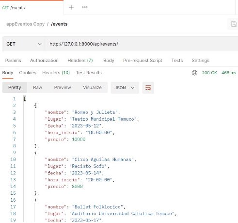

**A continuación se detallan los supuestos e instrucciones para la ejecución exitosa del servicio de gestión de tickets para eventos artísticos.**

- **Supuestos**
- Se tiene una base de datos en ambiente local, de nombre “eventos\_artisticos”,con puerto 3306, usuario root sin contraseña. Esta base de datos está sin tablas ya que se crean a través de migración en el proyecto Laravel.

◆

- La máquina donde está alojado el proyecto tiene instalados PHP 8.1 y Composer instalado.
- La colección creada en el proyecto debe importarse en Postman.
- **Instrucciones de ejecución**
- A través de una terminal y de git se debe clonar repositorio en la máquina donde se ejecutará.

- Dentro de la carpeta raíz del proyecto ejecutar el comando **composer install**.

- Duplicar archivo .env.example, en este nuevo archivo cambiar los parámetros para la conexión a la base de datos y cambiar el nombre a .env .

- Ejecutar las migraciones que crean las tablas en la base de datos, atraves del comando **php artisan migrate**.

- Importar archivo eventos\_artisticos.sql que está dentro de la carpeta raiz a la base de datos del mismo nombre.

- Ejecutar el servidor a traves del comando **php artisan serve.**

- Con el servido ejecutado, probar la colección de postman que se importó anteriormente.

- **Evidencias**
- Obtiene el listado de eventos disponibles, con la informacion mas relevante del evento.(GET/events)

- Obtiene la información completa de un evento.

 

- Si el evento no existe mostrará un mensaje de error.
- Crea la compra de un ticket para un cliente.

` `

- Si el usuario o el evento no existen mostrará un mensaje de error para ambos casos.
- Lista todas las compras de un cliente.

